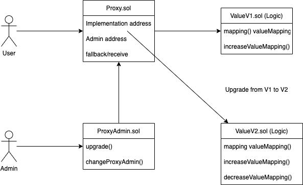

# Simple Transparent Proxy Pattern for Upgrading Contracts Without Openzeppelin

#### Note: the example code in this repo is not to be used for production development and only for learning purposes. Please use Openzeppelins upgradeable libraries for implementing a secure transparent-proxy-pattern. 

> The typical Proxy pattern of fallback->delegatecall can be used for separating Logic/Storage contracts but has several downsides including having your Proxy contract follow the exact storage of your Logic contracts which if done incorrectly can lead to security hacks, inability to return data from fallback functions, inability to separate admin-only Proxy function calls from user-only calls, risk of function-clashing, and risk of storage-clashing.

> The Transparent Proxy Pattern solves many of these issues by using assembly to implement the proxy-forwarding to return data from delegatecall & abi decoding to read the data, using a ProxyAdmin contract to pass on admin-only permissions for Proxy contract functions thus allowing admin-EOAs to also interact with Proxy and prevent function-clashing, and using EIP1967 Proxy Storage Slots to assign Admin/Implementation variables to specific storage slots to prevent storage-clashing.

